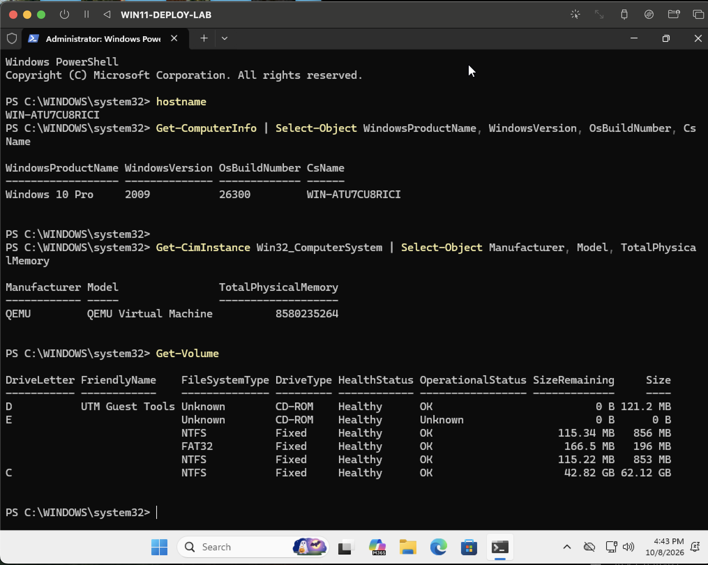
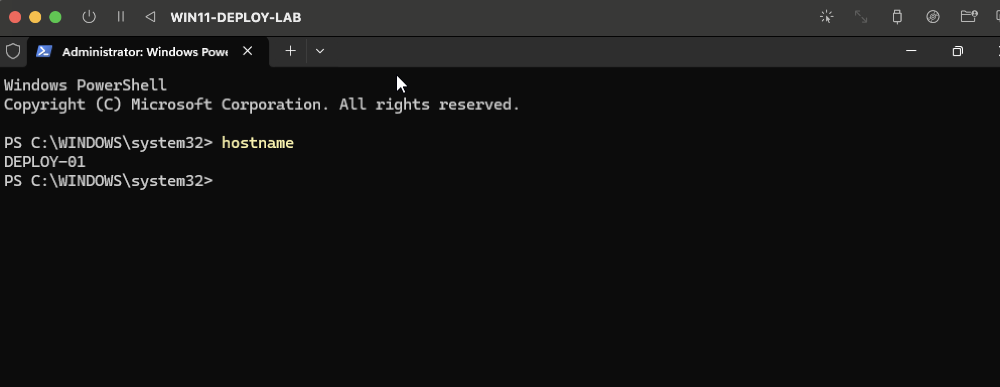
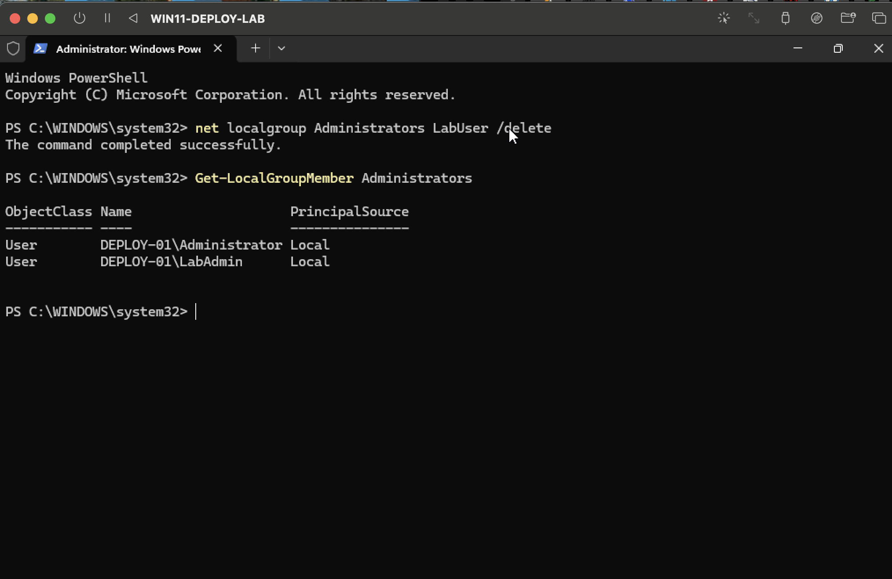
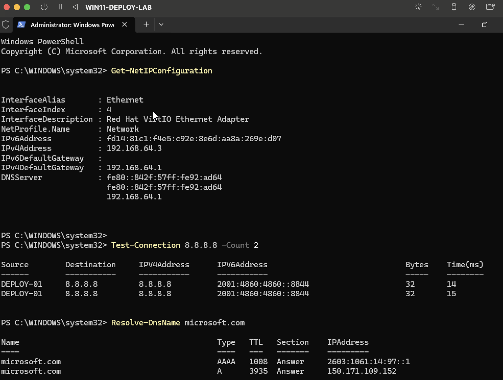
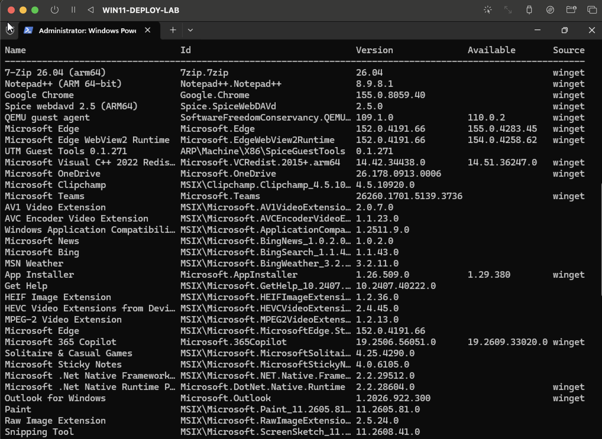
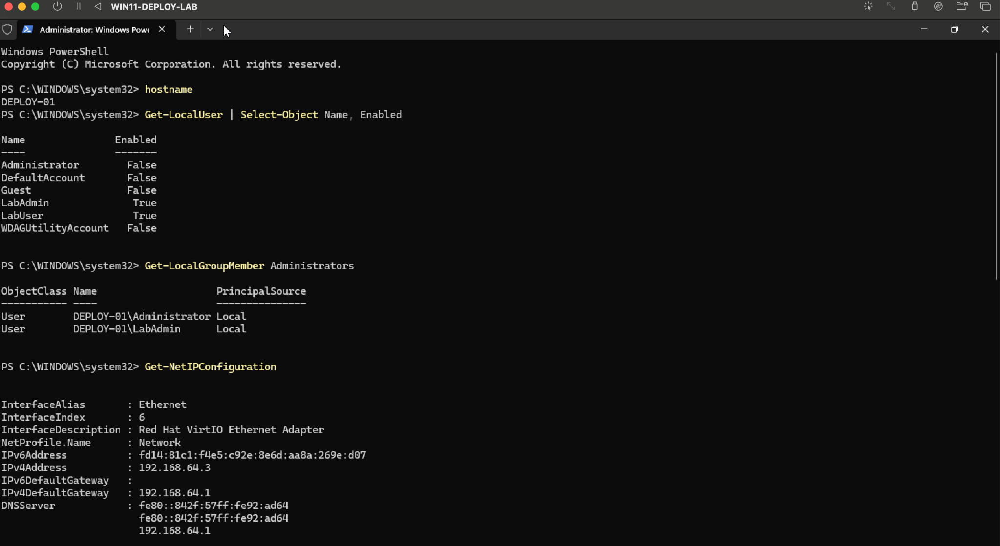

# Enterprise IT Support Workflow Lab

I built this lab to recreate the kind of Windows deployment and support work I’ve handled in professional IT environments, using only my own test environment and lab data.

## Lab Environment

- Windows 11 Pro ARM64
- UTM on macOS
- PowerShell
- winget
- QEMU / VirtIO guest tools

## What This Lab Covers

- Windows device provisioning
- Endpoint setup and validation
- Local account administration
- Least-privilege access
- Network and DNS troubleshooting
- Software deployment
- Device health checks
- PowerShell administration
- Ticket troubleshooting workflows
- Asset and device lifecycle management
- Knowledge base documentation

## 01 - Windows Device Provisioning and Deployment

For this lab, I treated a fresh Windows VM like a new endpoint that needed to be prepared for a user.

### What I did

- Captured a baseline of the new device with PowerShell
- Renamed the endpoint to `DEPLOY-01`
- Created separate `LabAdmin` and `LabUser` accounts
- Removed `LabUser` from the local Administrators group
- Installed Windows updates
- Validated IP configuration, gateway, connectivity, and DNS
- Installed standard software with `winget`
- Verified 7-Zip, Google Chrome, and Notepad++
- Checked Device Manager and investigated unknown virtual ACPI devices
- Completed a final deployment-readiness check

### Evidence

#### Fresh device baseline

*Captured the original hostname, Windows build, virtual hardware information, memory, and disk layout before making changes.*

#### Hostname standardization

*Renamed the endpoint to `DEPLOY-01` and verified the change after restart.*

#### Least-privilege account setup

*Removed `LabUser` from the local Administrators group and kept `LabAdmin` as the separate administrative account.*

#### Network and DNS validation

*Verified IP configuration, gateway connectivity, internet access, and DNS resolution from PowerShell.*

#### Software deployment

*Installed and verified 7-Zip, Google Chrome, and Notepad++ using `winget`.*

#### Deployment readiness

*Completed a final check of the device name, local users, administrator membership, networking, installed software, and Windows build.*

### Tools Used

`PowerShell` · `winget` · `Device Manager` · `Windows Update` · `Get-NetIPConfiguration` · `Test-Connection` · `Resolve-DnsName`

### Notes

During post-deployment validation, Device Manager showed several unknown ACPI devices in the UTM/QEMU virtual environment. I checked the hardware IDs, verified that networking, storage, and the rest of the VM were working normally, and treated the remaining entries as virtualization-specific instead of continuing to install unrelated drivers.

## Ticket Troubleshooting Case Studies

[View the ticket troubleshooting case studies](./ticket-case-studies/README.md)

## PowerShell Support and Automation

[View the PowerShell Endpoint Support Automation Lab](./powershell/README.md)

## Asset Inventory and Device Lifecycle

[View the Asset Inventory and Device Lifecycle Lab](./asset-management/README.md)

## Knowledge Base and Support Documentation

[View the Knowledge Base](./knowledge-base/README.md)

## Next Labs

- Software and hardware troubleshooting
- Technician guides and support documentation

## Why I Built This

I wanted a safe way to practice and document support workflows I’ve used professionally without using any employer systems, screenshots, data, or internal documentation.
