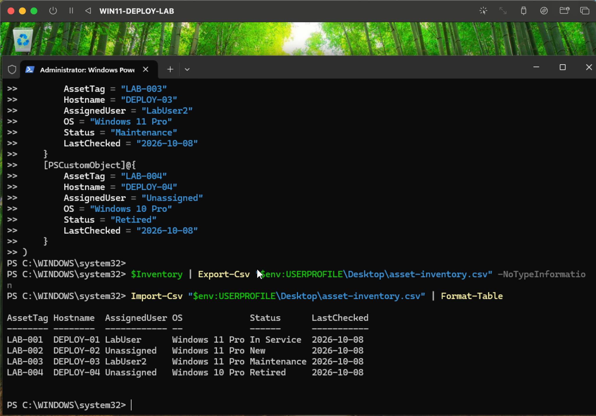
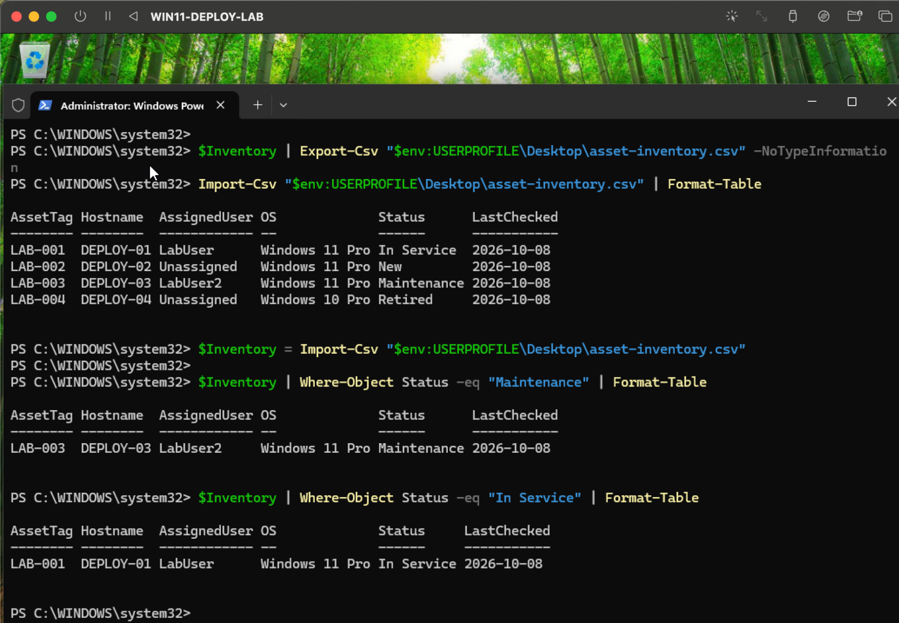
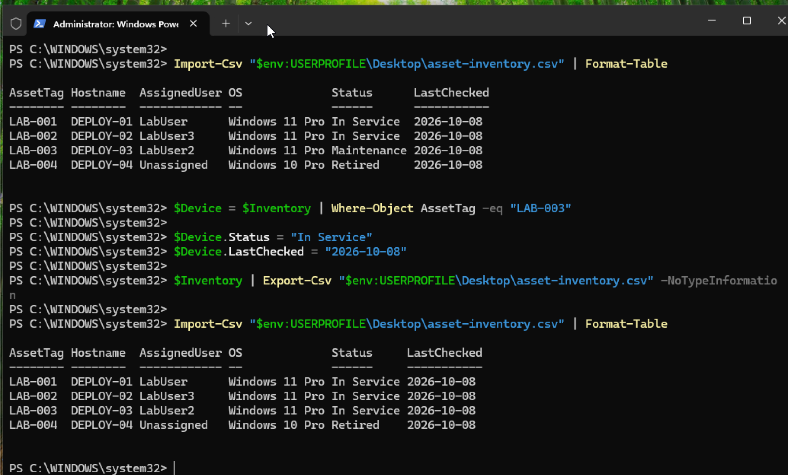

# Asset Inventory and Device Lifecycle

This lab demonstrates how PowerShell and CSV-based tracking can be used to manage endpoint inventory and document device lifecycle changes in a controlled test environment.

## What This Lab Covers

- Creating a structured asset inventory
- Tracking asset tags, hostnames, assigned users, operating systems, and device status
- Exporting inventory data to CSV
- Importing and reviewing asset records with PowerShell
- Filtering assets by lifecycle status
- Updating device assignment and status
- Verifying lifecycle changes after export

## Lifecycle States Used

- New
- In Service
- Maintenance
- Retired

## Evidence

### Initial Asset Inventory

*Created a structured inventory containing multiple test endpoints in different lifecycle states.*

### Status Filtering

*Used PowerShell to filter inventory records by device status, including Maintenance and In Service.*

### Lifecycle Status Update

*Updated an endpoint from Maintenance to In Service, exported the revised inventory, and verified the change.*

## Inventory File

[View the asset inventory CSV](./asset-inventory.csv)

## Skills Demonstrated

- IT asset management
- Device lifecycle tracking
- PowerShell
- CSV import and export
- Inventory filtering
- Endpoint assignment tracking
- Data validation
- Technical documentation
