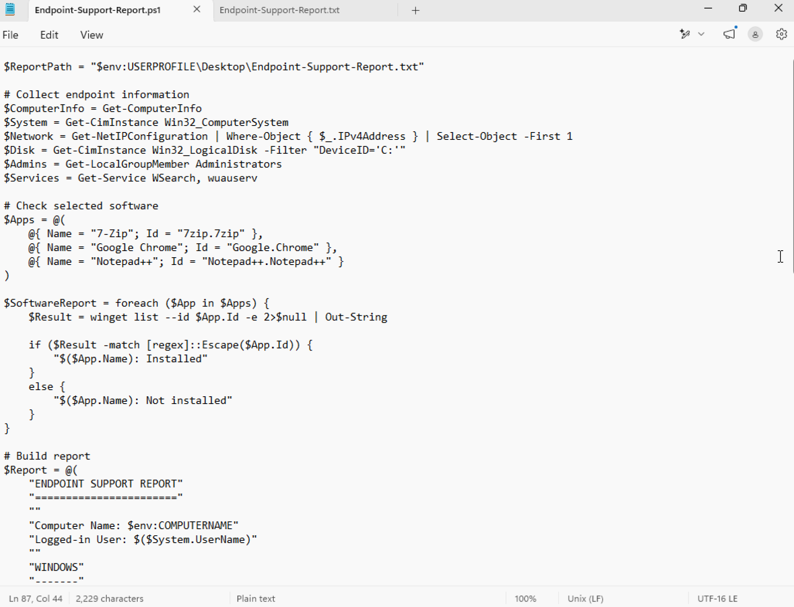
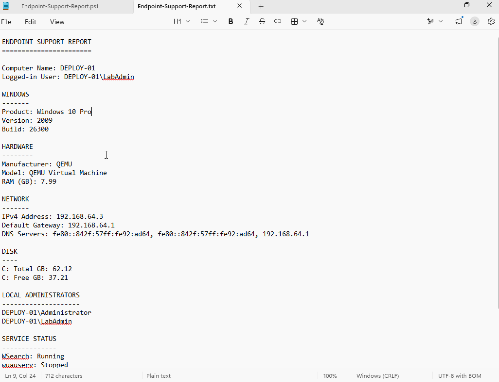
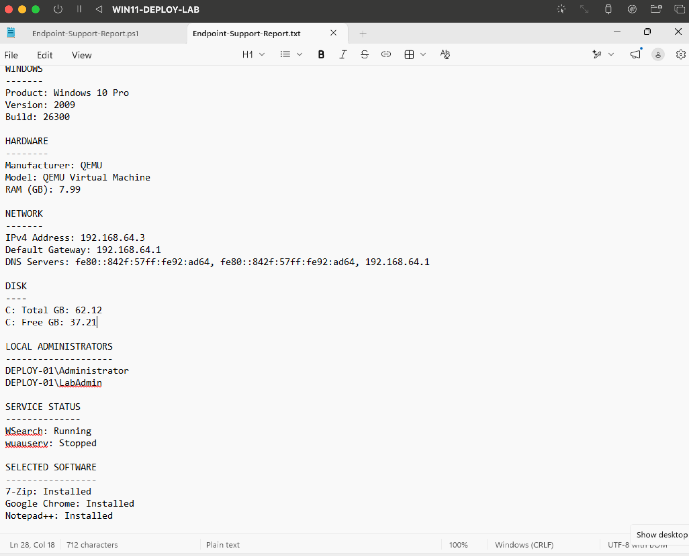

# PowerShell Endpoint Support Automation

This lab demonstrates how PowerShell can be used to automate common endpoint support checks and create a reusable system report.

## What the Script Checks

- Computer name and logged-in user
- Windows product, version, and build
- Hardware manufacturer, model, and memory
- IPv4 address, gateway, and DNS servers
- Disk capacity and free space
- Local administrator membership
- Windows Search and Windows Update service status
- Installation status for 7-Zip, Google Chrome, and Notepad++

## Script

[View the PowerShell script](./Endpoint-Support-Report.ps1)

## Evidence

### Endpoint Support Script

*Created a reusable PowerShell script that collects common endpoint support information and checks selected applications.*

### System and Network Report

*Generated a support report containing Windows, hardware, network, disk, administrator, and service information.*

### Software and Service Validation

*Verified Windows service status and confirmed that standard support applications were installed.*

## Skills Demonstrated

- PowerShell scripting
- Endpoint administration
- System information collection
- Network troubleshooting
- Local account administration
- Windows service management
- Software verification
- Support automation
- Technical documentation
