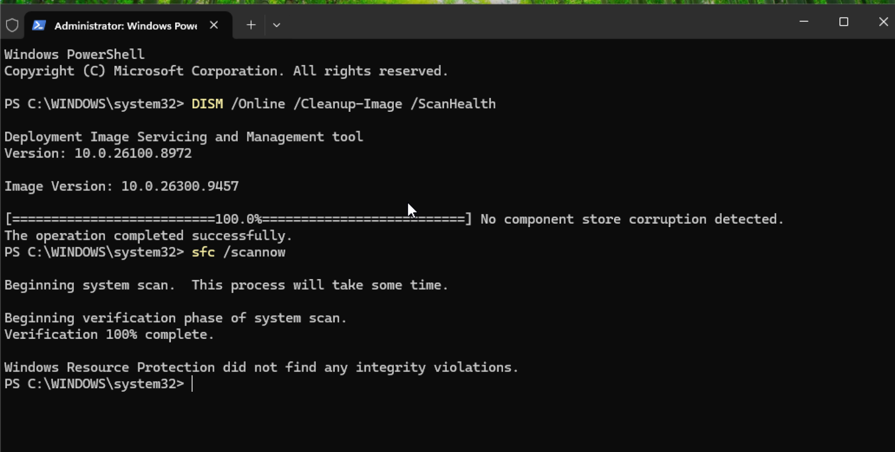
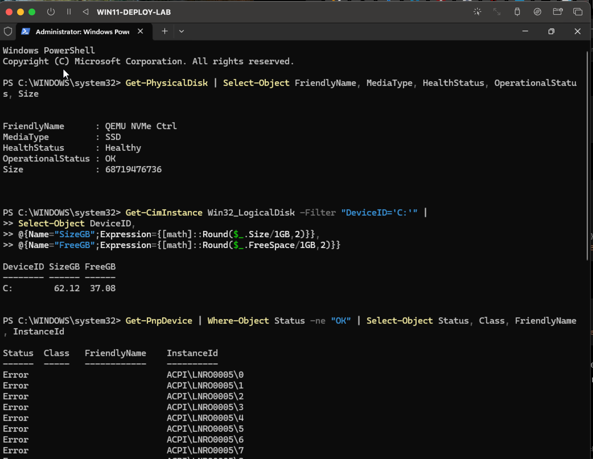

# Software and Hardware Troubleshooting

This lab demonstrates endpoint troubleshooting using Windows system integrity checks, storage health validation, and device-status inspection in a controlled virtual environment.

## Software Integrity Checks

I used Windows servicing and system file tools to verify operating system integrity.

### DISM Component Store Scan

```powershell
DISM /Online /Cleanup-Image /ScanHealth
```

Result:

- No component store corruption detected
- Operation completed successfully

### System File Checker

```powershell
sfc /scannow
```

Result:

- Verification completed successfully
- Windows Resource Protection did not find any integrity violations

## Hardware and Device Health Checks

I used PowerShell to review storage health, disk capacity, and devices reporting non-OK status.

### Physical Disk Health

```powershell
Get-PhysicalDisk | Select-Object FriendlyName, MediaType, HealthStatus, OperationalStatus, Size
```

The virtual NVMe storage device reported:

- Media type: SSD
- Health status: Healthy
- Operational status: OK

### Disk Capacity

```powershell
Get-CimInstance Win32_LogicalDisk -Filter "DeviceID='C:'" |
Select-Object DeviceID,
@{Name="SizeGB";Expression={[math]::Round($_.Size/1GB,2)}},
@{Name="FreeGB";Expression={[math]::Round($_.FreeSpace/1GB,2)}}
```

The system drive had sufficient available storage and no storage-health issues were detected.

### Device Status Review

```powershell
Get-PnpDevice | Where-Object Status -ne "OK" |
Select-Object Status, Class, FriendlyName, InstanceId
```

Several `ACPI\LNR00005` devices appeared with error status.

These entries were identified as UTM/QEMU virtualization-specific ACPI devices. Storage, networking, and normal endpoint operation were functioning correctly, so the entries were treated as virtualization-related rather than physical hardware failures.

## Evidence

### Windows Integrity Validation



*Validated the Windows component store and protected system files using DISM and System File Checker.*

### Hardware and Device Health



*Reviewed virtual disk health, storage capacity, and non-OK device entries with PowerShell.*

## Skills Demonstrated

- Windows troubleshooting
- DISM
- System File Checker
- Storage health validation
- PowerShell hardware inspection
- Plug and Play device troubleshooting
- Virtualization awareness
- Root-cause analysis
- Post-check validation
