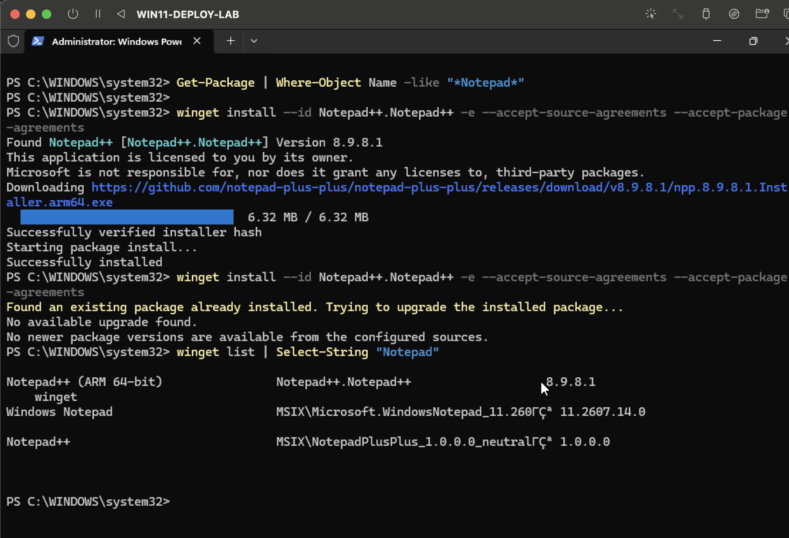
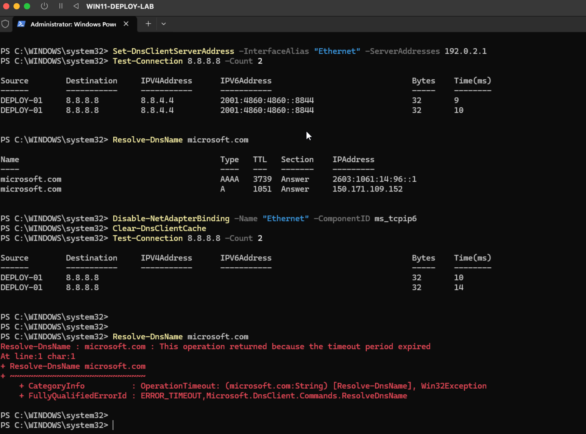
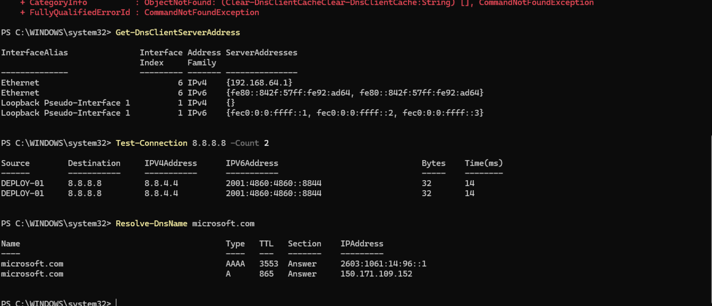

# Ticket Troubleshooting Case Studies

These case studies recreate common support issues in a controlled Windows lab. Each one follows the same workflow I’d use when handling a ticket: confirm the problem, isolate the cause, apply a fix, and verify the result.

## Case Study 1 - Application Failure

### Issue

Notepad++ was unavailable and could not be launched.

### Troubleshooting

I checked the installed package state with PowerShell and `winget` and confirmed that Notepad++ was no longer installed.

### Resolution

I reinstalled Notepad++ using `winget`, verified the package installation, and launched the application successfully.

### Skills Used

- Application troubleshooting
- PowerShell
- winget
- Software installation and verification
- End-user validation

---

## Case Study 2 - DNS Resolution Failure

### Issue

The endpoint still had network connectivity, but hostname resolution was failing.

### Troubleshooting

I tested connectivity directly to an IP address and confirmed that the network connection was still working. I then tested DNS resolution separately and reproduced a timeout when resolving `microsoft.com`.

This isolated the problem to DNS rather than the network adapter or general internet connectivity.

### Resolution

I restored the correct DNS configuration, re-enabled the normal network bindings, and verified both IP connectivity and hostname resolution.

### Skills Used

- DNS troubleshooting
- TCP/IP troubleshooting
- `Test-Connection`
- `Resolve-DnsName`
- `Get-DnsClientServerAddress`
- Network configuration
- Root-cause isolation

---

## Case Study 3 - Windows Search Indexing Failure

### Issue

Windows Search reported that search indexing was turned off.

### Troubleshooting

I checked the Windows Search service and confirmed that `WSearch` was stopped. The Search interface also showed that indexing was disabled.

### Resolution

I restarted the Windows Search service, set it to start automatically, rebuilt the search index, and verified that normal search results returned without the indexing warning.

### Skills Used

- Windows service troubleshooting
- PowerShell service management
- Windows Search
- Indexing Options
- Root-cause analysis
- Post-fix verification
